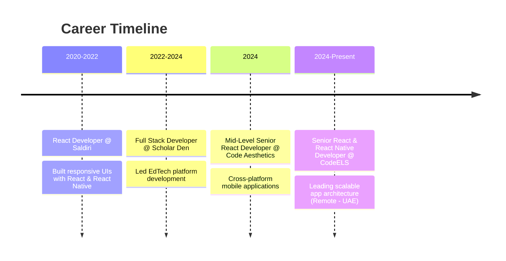

<div align="center">

# 👋 Hassan Pro Developer

### Senior React & React Native Developer | Full Stack Engineer

*Building modern, scalable applications that bridge complex technology with user-friendly experiences*

[](https://linkedin.com/in/hassanprodeveloper)
[](https://hassanprodeveloper.com)
[](mailto:hassanprodeveloper@gmail.com)

</div>

---

## 🚀 About Me

I'm a **Full Stack Developer** with **5+ years of experience** specializing in building scalable web and mobile applications. I transform complex problems into elegant solutions that make a real impact.

Currently leading development at **CodeELS (UAE)** as a **Senior React & React Native Developer**, where I architect cross-platform applications serving thousands of users globally.

💡 **Philosophy:** Clean code, thoughtful design, and continuous learning drive everything I do.

---

## 💼 Professional Journey



### 🎯 Current Role: CodeELS (Sep 2024 - Present)
- Leading development of scalable web and mobile applications
- Architecting cross-platform solutions with React and React Native
- Managing technical teams and conducting code reviews
- Remote collaboration with international teams

---

## 🛠️ Tech Stack

### **Frontend Expertise**


### **State Management & Data Fetching**


### **Backend & Database**


### **Tools & Services**


---

## 🌟 Featured Projects

### 🕌 [Quran Application](https://hassanprodeveloper.com/projects/quran-application)
**MERN Stack & React Native** | *CodeELS (2025-Present)*

A comprehensive cross-platform Quranic platform with AI-powered assistance.

**Key Features:**
- 🤖 AI-powered Quran chatbot for interactive learning
- 📱 Cross-platform (iOS & Android) with offline support
- 🎵 High-quality audio playback with synchronization
- 💳 Subscription management via RevenueCat
- 🔐 Secure authentication with Supabase Auth

**Tech:** React Native (Expo), Next.js, TypeScript, Supabase, Drizzle ORM, Zustand, SQLite

---

### 🛍️ [MatesLive & MShop Ecosystem](https://hassanprodeveloper.com/projects/mateslive-mshop-ecosystem)
**Multi-Portal Suite** | *CodeELS (2024-2025)*

A complete suite of web portals for social networking and e-commerce.

**Key Features:**
- 💰 **$1M+ transactions** processed through integrated payment gateways
- 🔐 Role-based access control across multiple portals
- 📊 Real-time dashboards and analytics
- 💳 Multiple payment integrations (EasyPaisa, JazzCash, Telr, Tap, Mate Wallet)
- 👥 Thousands of daily active users

**Tech:** Next.js, Redux, TypeScript, TailwindCSS, Firebase, React Query, Zego Cloud

---

### 📚 [Nemrah Ahmad LMS Ecosystem](https://hassanprodeveloper.com/projects/nemrah-ahmad-lms)
**Learning Management System** | *Code Aesthetics (2024)*

A comprehensive LMS with IP-protected content and synchronized learning.

**Key Features:**
- 📖 Lexical-based book reader with synchronized audio
- 🍎 Apple In-App Purchases integration
- 🔔 Firebase push notifications
- 🎯 Role-based admin dashboard
- 🔒 Content security and IP protection

**Tech:** React Native, Redux Toolkit, RTK Query, Lexical, Firebase, Next.js, TypeScript

---

### 💬 [Astra Chat](https://hassanprodeveloper.com/projects/astra-chat-decentralized-messaging)
**Decentralized Messaging Platform**

End-to-end encrypted messaging built on the Matrix protocol.

**Key Features:**
- 🔐 End-to-end encryption
- 🌐 Decentralized architecture
- 📹 WebRTC-based video conferencing
- 🔒 Matrix protocol implementation

**Tech:** React Native, Matrix Protocol, WebRTC, Rust, E2EE

---

### 📖 [Scholar Den Platform](https://hassanprodeveloper.com/projects/scholarden-ecosystem)
**EdTech Platform** | *Scholar Den (2022-2024)*

GRE preparation platform with secure payments and academic resources.

**Tech:** Next.js, Firebase, Stripe, PayPal, Web Platform

---

## 📊 GitHub Analytics

<div align="center">


</div>

---

## 🎓 Education & Certifications

**Bachelor of Science (BS) in Computer Science**  
Virtual University of Pakistan (2019–2023)

**Web & Mobile Hybrid Application Development**  
Saylani Mass IT Training (SMIT) — 2019–2020

---

## 💪 Core Competencies

```javascript
const hassanSkills = {
  architecture: ['Scalable Systems', 'Cross-platform Development', 'Microservices'],
  frontend: ['React.js', 'Next.js', 'TypeScript', 'Responsive Design'],
  mobile: ['React Native', 'Expo', 'iOS & Android Publishing'],
  backend: ['Node.js', 'Express.js', 'RESTful APIs', 'Database Design'],
  leadership: ['Team Management', 'Code Reviews', 'Agile Methodology'],
  specialties: [
    'Payment Gateway Integration',
    'Real-time Applications',
    'AI-powered Features',
    'Performance Optimization',
    'E2E Encryption',
    'Offline-First Architecture'
  ]
};
```

---

## 🌍 Let's Connect

I'm always interested in collaborating on innovative projects and discussing new opportunities!

- 💼 **Portfolio:** [hassanprodeveloper.com](https://hassanprodeveloper.com)
- 💌 **Email:** [hassanprodeveloper@gmail.com](mailto:hassanprodeveloper@gmail.com)
- 💬 **WhatsApp:** [+92 339 3700010](https://wa.me/923393700010)
- 🔗 **LinkedIn:** [linkedin.com/in/hassanprodeveloper](https://linkedin.com/in/hassanprodeveloper)

---

<div align="center">

### 💡 *"Clean code, thoughtful design, and continuous learning drive everything I do."*


**⭐ From [hassanprodeveloper](https://github.com/hassanprodeveloper)**

</div>
