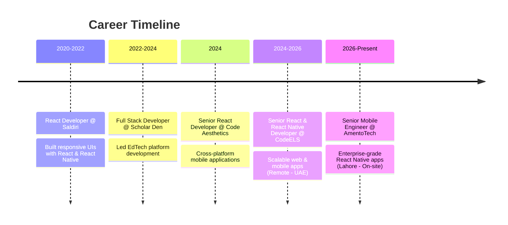

<div align="center">

# 👋 Muhammad Hassan

### Senior Frontend & Mobile Engineer — React | React Native | Next.js

*Building modern, scalable applications that bridge complex technology with user-friendly experiences*

[](https://linkedin.com/in/hassanprodeveloper)
[](https://hassanprodeveloper.com)
[](mailto:hassanprodeveloper@gmail.com)

</div>

---

## About Me

Senior Frontend & Mobile Engineer with 5+ years of experience leading
teams and delivering end to end web and mobile products. I manage the full
lifecycle from client requirements to clean architecture, reusable
components, performance optimization, and stable production releases.
I reduced build time by 30% and cut redundant code by 40% through
structured refactoring and smarter workflows, while keeping code quality
non negotiable. I learn fast and use AI daily for analysis, debugging support,
refactor planning, and documentation to ship faster without sacrificing
maintainability.

**Philosophy:** Clean code, thoughtful design, and continuous learning drive everything I do.

---

## Professional Journey


```mermaid
timeline
    title Career Timeline
    2020-2022 : React Developer @ Saldiri
              : Built responsive UIs with React & React Native
    2022-2024 : Full Stack Developer @ Scholar Den
              : Led EdTech platform development
    2024      : Senior React Developer @ Code Aesthetics
              : Cross-platform mobile applications
    2024-2026 : Senior React & React Native Developer @ CodeELS
              : Scalable web & mobile apps (Remote - UAE)
    2026-Present : Senior Mobile Engineer @ AmentoTech
                 : Enterprise-grade React Native apps (Lahore - On-site)
```

### Current Role: Senior Mobile Engineer @ AmentoTech (Jun 2026 - Present)
- Lead end-to-end development of enterprise-grade mobile applications with React Native & Expo
- Architect scalable, offline-capable solutions using TypeScript, Zustand, and React Query
- Integrate real-time features including WebSockets and push notifications
- Work across REST APIs and GraphQL with Firebase / Supabase backend services
- Establish mobile best practices, CI/CD pipelines, and App Store / Play Store deployment workflows
- Collaborate cross-functionally with product, design, and backend teams to ship secure, high-performance apps

> **Previously @ CodeELS (Sep 2024 - Jun 2026, Remote - UAE):** Led scalable React & Next.js
> apps, built reliable payment flows handling **$1M+** in transactions, reduced build time by 30%
> and code redundancy by 40%, and mentored developers to improve delivery workflows.

---

## Tech Stack

### **Frontend & Mobile**


### **State Management & Data Fetching**


### **Backend & Database**


### **Real-time & Specialized**


### **Tools & Services**


---

## Featured Projects

### 🕌 [Quran AI App (AI-Powered Reading & Prayer Tracking)](https://hassanprodeveloper.com/projects/quran-ai)
**Role: Lead MERN Stack & React Native Developer** | *Aug 2025 - Present*

- Architected a cross-platform Quranic platform with a MERN-based backend and a React Native (Expo) app.
- Built an AI-powered chatbot with streaming responses, plus offline reading and daily streak systems.
- Implemented offline-first persistence with SQLite and Zustand for a seamless no-network experience.
- Handled subscriptions with RevenueCat and shipped to the Apple App Store and Google Play Store.

**Tech:** React Native, Expo, TypeScript, Next.js, Node.js, Express.js, Drizzle ORM, Supabase, SQLite

---

### [MatesLive & MShop (Social & E-commerce Ecosystem)](https://hassanprodeveloper.com/projects/mate-ecosystem)
**Role: Lead Frontend Engineer** | *Sep 2024 - Sep 2025*

A complete suite of web portals for social networking and e-commerce.

**Key Features:**
- 💰 **$1M+ transactions** processed through integrated payment gateways
- 🔐 Role-based access control across multiple portals (creators, agencies, merchants, admins)
- 📊 Real-time dashboards and moderation tooling
- 💳 Multiple payment integrations (EasyPaisa, JazzCash, Telr, Tap, Epay, Mate Wallet)
- ⚡ SSR/SSG-optimized performance and SEO

**Tech:** Next.js, Redux, TypeScript, TailwindCSS, Firebase, React Query, Zego Cloud

---

### 🔐 [Astra Chat (Decentralized Messaging Platform)](https://hassanprodeveloper.com/projects/astra-chat)
**Role: Solo Lead Engineer** | *4-week delivery*

End-to-end encrypted messaging built on the Matrix protocol — with **zero custom backend**.

**Key Features:**
- 🔐 Full end-to-end encryption with device verification & key backup
- 🌐 Decentralized Matrix protocol architecture (via a Rust-based SDK through Turbo Modules)
- 📹 Voice & video calling powered by LiveKit
- 🗄️ Secure local storage via OS Keychain

**Tech:** React Native, Matrix Protocol, LiveKit, TypeScript, Zustand, SQLite

---

### [Nemrah Ahmad LMS](https://hassanprodeveloper.com/projects/nemrah-ahmad-lms)
**Learning Management System** | *Code Aesthetics (Feb 2024 - Sep 2024)*

A comprehensive, IP-protected LMS with synchronized audio-text reading. [📱 App Store](https://apps.apple.com/pk/app/nemrah-ahmad/id6504430475)

**Key Features:**
- 📖 Custom Lexical-based book reader with synchronized audio
- 🍎 Apple In-App Purchases integration
- 🔔 Firebase push notifications
- 🔒 Content security with screen-capture prevention

**Tech:** React Native, Redux Toolkit, RTK Query, Lexical, Firebase, Next.js, TypeScript

---

### [Scholar Den Platform](https://hassanprodeveloper.com/projects/scholarden-ecosystem)
**EdTech Platform** | *Scholar Den (Mar 2022 - Feb 2024)*

GRE preparation platform with secure international payments and academic resources.

**Tech:** Next.js, Firebase, Stripe, PayPal, TypeScript, Tailwind CSS

---

### 🛠️ [React Mail Builder](https://hassanprodeveloper.com/projects/react-mail-builder) · *Open Source*
**Drag-and-drop email template builder** with clean HTML export and responsive previews.
[Live Demo](https://react-mail-builder.vercel.app/) · [GitHub](https://github.com/hassanprodeveloper/react-mail-builder)

**Tech:** React, TypeScript, TailwindCSS

---

## GitHub Analytics

<div align="center">


</div>

---

## Education & Certifications

**Bachelor of Science (BS) in Computer Science**  
Virtual University of Pakistan (2019–2023)

**Web & Mobile Hybrid Application Development**  
Saylani Mass IT Training (SMIT) — 2019–2020

---

## Core Competencies

```javascript
const hassanSkills = {
  architecture: ['Scalable Systems', 'Cross-platform Development', 'Offline-First Architecture'],
  frontend: ['React.js', 'Next.js', 'TypeScript', 'Responsive Design', 'SSR/SSG'],
  mobile: ['React Native', 'Expo', 'iOS & Android Publishing'],
  backend: ['Node.js', 'Express.js', 'RESTful APIs', 'GraphQL', 'Database Design'],
  leadership: ['Team Management', 'Code Reviews', 'Agile Methodology', 'Mentorship'],
  specialties: [
    'Payment Gateway Integration',
    'Real-time Applications',
    'AI-powered Features',
    'Performance Optimization',
    'E2E Encryption',
    'Offline-First Architecture'
  ]
};
```

---

## Let's Connect

I'm always interested in collaborating on innovative projects and discussing new opportunities!

- 💼 **Portfolio:** [hassanprodeveloper.com](https://hassanprodeveloper.com)
- 💌 **Email:** [hassanprodeveloper@gmail.com](mailto:hassanprodeveloper@gmail.com)
- 💬 **WhatsApp:** [+92 339 3700010](https://wa.me/923393700010)
- 🔗 **LinkedIn:** [linkedin.com/in/hassanprodeveloper](https://linkedin.com/in/hassanprodeveloper)

---

<div align="center">

### *"Clean code, thoughtful design, and continuous learning drive everything I do."*


**From [hassanprodeveloper](https://github.com/hassanprodeveloper)**

</div>
